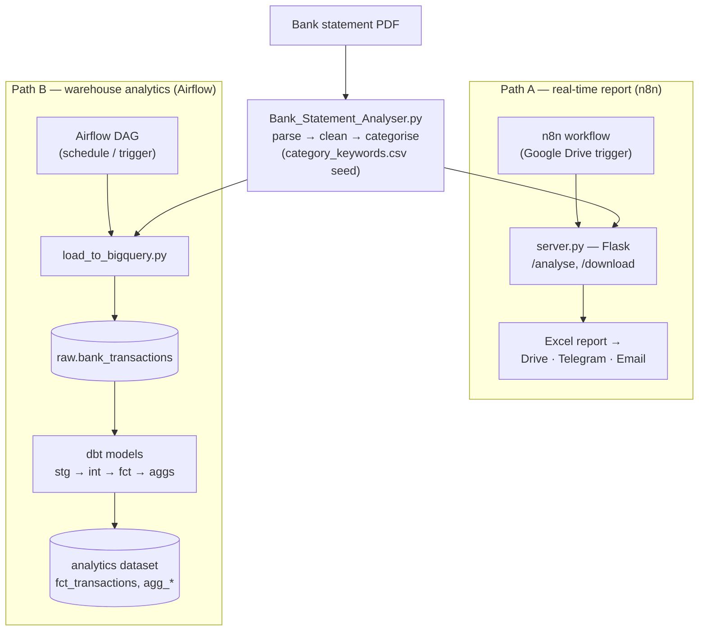
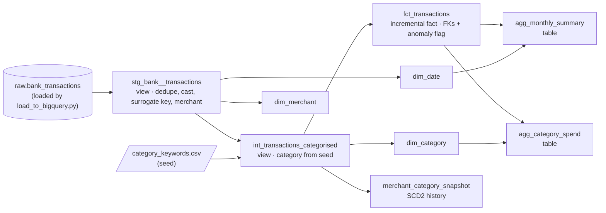

# 💳 Bank Statement Analyser — with Automation

[](https://github.com/ARAVINDHRAJA123/Bank-Statement-Analyser/actions/workflows/ci.yml)

A data pipeline that turns HDFC bank-statement PDFs into two things, from one
Python parser:

1. **An instant Excel report** — delivered automatically by an n8n workflow that
   watches Google Drive, runs the analyser through a Flask service, and sends the
   report back over Telegram and Email.
2. **A tested BigQuery analytics warehouse** — parsed transactions are loaded to
   BigQuery and modelled with dbt into a **dimensional star schema** (an
   incremental fact table, date/merchant/category dimensions, an SCD2 history
   snapshot, and data tests), orchestrated by Airflow.

In plain terms: drop in a bank statement, get back a clean spending report *and*
a queryable history of your transactions.

📘 **New here?** Start with the **[step-by-step Usage Guide](https://aravindhraja123.github.io/Bank-Statement-Analyser/usage.html)**
— a modern, click-through walkthrough of everything below (or open `docs/usage.html` locally in any browser).

<sub>📱 On a phone? Scan to open the live guide:</sub><br>


🧾 **All terminal commands** (copy-paste, step by step): [`docs/COMMANDS.md`](docs/COMMANDS.md)
· 🍎 **macOS setup:** [`docs/SETUP_MAC.md`](docs/SETUP_MAC.md)


---

## 🏗️ Architecture (two paths, one parser)

One parser core feeds two independent delivery paths. **Path A** gives you an
instant Excel report when a statement lands (orchestrated by n8n). **Path B**
keeps a tested BigQuery warehouse refreshed on a schedule (orchestrated by
Airflow). Both share the same parser and the same category seed, so categories
stay identical across the report and the warehouse.



| Path | Owner | Trigger | Output | When |
|------|-------|---------|--------|------|
| **A — report** | n8n + Flask (`server.py`) | new PDF in Google Drive | Excel → Drive / Telegram / Email | real-time |
| **B — analytics** | Airflow (`airflow/`) + dbt (`dbt_bank/`) | schedule / manual | BigQuery `analytics` models | batch |

📚 **Analytics layer setup:** [`airflow/README.md`](airflow/README.md)

---

## 🤖 Automation Pipeline (n8n)

Upload a PDF to Google Drive → n8n detects it → Flask server runs the
analyser → Excel report uploaded to a dated output folder → Telegram and
Email summary sent automatically.
```
Google Drive (Bank Statements folder)
        │
        ▼
n8n — Google Drive Trigger
        │
        ▼
Flask server (server.py) — runs Bank_Statement_Analyser.py
        │
        ▼
Google Drive (Bank Statement Reports/Output_DD-MM-YYYY/)
        │
        ▼
Telegram + Email — summary with spend, category, anomalies
```

### n8n Automation Workflow


### Automation Setup

**1. Install dependencies:**
```bash
pip install -r requirements.txt
```

**2. Start the Flask server:**
```bash
python server.py
```

**3. Import the workflow into n8n:**
```bash
npm install -g n8n
n8n start
```
Open `http://localhost:5678` → import `workflow_automation.json`

**4. Configure credentials in n8n:**
- Google Drive OAuth2 — your personal Google account
- Telegram — Bot Token and Chat ID
- Email (SMTP) — Gmail App Password

**5. Create these folders in Google Drive:**
- `Bank Statements` — upload PDFs here
- `Bank Statement Reports` — Excel reports saved here automatically

**6. Publish the workflow in n8n**

---

## 📊 Analytics Layer (BigQuery + dbt + Airflow)

The batch path lands parsed transactions in BigQuery and models them with dbt
into a **dimensional star schema**: an incremental `fct_transactions` fact table
surrounded by `dim_date` / `dim_merchant` / `dim_category` dimensions, plus
monthly and category aggregates. It also keeps an **SCD2 snapshot** of each
merchant's category (history of changes), and a reusable **surrogate-key macro**
builds the keys. All orchestrated by Airflow and covered by data tests —
including foreign-key (relationship) tests between the fact and its dimensions.

**dbt model lineage:**



**Usage:**
```powershell
# 1. land a statement in BigQuery
$env:GCP_PROJECT="your-project"; $env:BQ_LOCATION="asia-south1"
python load_to_bigquery.py "statement.pdf"

# 2. build + test the warehouse models
cd dbt_bank
dbt debug           # check the connection
dbt build           # seeds + models + tests (fct_transactions is incremental)
dbt build --full-refresh   # rebuild from scratch (e.g. to re-score anomalies)
```
Airflow can run this on a schedule — see [`airflow/README.md`](airflow/README.md).

📖 **Interactive dbt docs** (models, columns, lineage graph) are published via
GitHub Pages:
[aravindhraja123.github.io/Bank-Statement-Analyser](https://aravindhraja123.github.io/Bank-Statement-Analyser/)
— or browse locally with `cd dbt_bank && dbt docs generate && dbt docs serve`.

📈 **BI dashboard:** a Data Studio dashboard is built on the
marts — KPI scorecards (income, expense, net, anomalies), monthly income vs
expense, spend by category, and top merchants. It isn't linked here because it
renders real transactions; rebuild it on a sample statement to share publicly.

⚙️ **Continuous integration:** every push and pull request runs the pytest suite
and `dbt parse` via GitHub Actions (the build badge at the top), so code or model
regressions are caught automatically.

> **Requirements & notes**
> - Needs a GCP project with **BigQuery billing enabled** — incremental models
>   use a `MERGE` (DML), which the free-tier sandbox blocks. The workload stays
>   inside the free monthly allowances (10 GB storage / 1 TB queries).
> - The `raw` dataset, the dbt profile, and the loader must share the same
>   `BQ_LOCATION` (region), or dbt will fail.
> - **Never commit financial data.** `.gitignore` blocks `*.pdf` / `*.xlsx` /
>   `*.png`; keep input statements and generated reports untracked.

---

## 🧠 AI Features (agentic, on the warehouse)

Two optional AI features run on top of the BigQuery marts. They run on **Claude**
(paid) **or a free Google Gemini key** — the code auto-selects whichever you set.

**1. Ask-your-statement — agentic text-to-SQL** ([`ai/ask_statement.py`](ai/ask_statement.py)).
Ask a plain-English question; the model is given one tool (`run_sql`) and runs the
agent loop itself — writes a query, runs it, reads the rows, and answers:
```bash
python ai/ask_statement.py "how much did I spend on food, by month?"
```
You can ask it three ways: the **CLI** above, a **web UI** (run `python server.py`
and open **http://localhost:5050/**), or the **`POST /ask`** HTTP endpoint (for
n8n / other apps). The endpoint degrades gracefully if the AI deps/key are absent.

**2. Anomaly explainer — batch enrichment** ([`ai/explain_anomalies.py`](ai/explain_anomalies.py)).
Turns each flagged transaction into a one-sentence plain-English reason:
```bash
python ai/explain_anomalies.py            # print
python ai/explain_anomalies.py --write    # also save to analytics.anomaly_explanations
```

> **Read-only safety wall.** The text-to-SQL tool only ever runs `SELECT`/`WITH`
> queries (DML/DDL is rejected before execution), is scoped to the `analytics`
> dataset, and runs under a `maximum_bytes_billed` cap — the model can read and
> reason over the data but can never modify it or run up a bill.

> **Provider & key — pick one (auto-detected):**
> - **Claude:** set `ANTHROPIC_API_KEY` (`pip install anthropic`); model
>   `claude-opus-4-8`. Pay-per-use (prompts here are tiny).
> - **Gemini (free):** set `GEMINI_API_KEY` (`pip install google-genai`);
>   model `gemini-2.5-flash`. Free tier, no card — get a key at
>   [aistudio.google.com/app/apikey](https://aistudio.google.com/app/apikey).

---

## 🚀 Quick Start (Script only — no automation)
```bash
pip install -r requirements.txt
```

Place your HDFC PDF in the folder and run (defaults to `Account Statement.pdf`
if no path is given):
```bash
python Bank_Statement_Analyser.py "your statement.pdf"
```

Open `Bank_Statement_Report.xlsx` to see your report.

### Run the tests
```bash
python -m pytest -q
```

---

## 📦 Requirements

- Python 3.10+ for the analyser & Flask server (the BigQuery loader was run on
  3.14). dbt runs in its own Python 3.12 virtualenv, installed separately.
- Node.js 18+ (for the n8n automation only)
- See `requirements.txt`:
```
pdfplumber>=0.11.0              # PDF parsing
openpyxl>=3.1.0                 # Excel report
flask>=3.0.0                    # server.py (the n8n bridge)
google-cloud-bigquery>=3.0.0   # load_to_bigquery.py
pytest>=8.0.0                  # test suite
anthropic                      # AI features (ai/) — Claude path (ANTHROPIC_API_KEY)
google-genai                   # AI features (ai/) — free Gemini path (GEMINI_API_KEY)
```
> `dbt-bigquery` is installed in a separate Python 3.12 venv, not via this file
> — see [`airflow/README.md`](airflow/README.md).

---

## ⚙️ How It Works
```
Account Statement.pdf
        │
        ▼
┌──────────────────────────┐
│  Spatial PDF Extraction  │  Reads every word with its x/y position on the page
│  (pdfplumber)            │  Assigns each word to the correct column by coordinate
│                          │  Reconstructs multi-line narrations automatically
└───────────┬──────────────┘
            │
            ▼
┌──────────────────────────┐
│  Clean & Enrich          │  Removes duplicates
│                          │  Extracts clean merchant names from UPI/POS/NEFT strings
│                          │  Assigns a spending category to each transaction
└───────────┬──────────────┘
            │
            ▼
┌──────────────────────────┐
│  Analytics               │  Monthly income vs expense breakdown
│                          │  Category-wise spending summary
│                          │  Top 10 merchants by spend
│                          │  Anomaly detection — flags unusually large transactions
└───────────┬──────────────┘
            │
            ▼
   Bank_Statement_Report.xlsx
```

---

## 📊 Output — 6 Sheets

### 1. Summary
Total income, total expenses, net cash flow, transaction counts, largest credit, largest debit — all in one place.

### 2. Transactions
Full transaction list with date, merchant, narration, ref number, debit, credit, balance, category, and an anomaly flag. Debits in red, credits in green. Flagged rows highlighted.

| Date | Merchant | Narration | Ref No | Value Date | Debit (₹) | Credit (₹) | Balance (₹) | Category | Flag |
|------|----------|-----------|--------|------------|-----------|------------|-------------|----------|------|

### 3. Monthly Summary
Income, expense, and net per month with a clustered bar chart comparing income vs expense side by side. Value labels shown on every bar.

### 4. Categories
Spending grouped into real categories — Food & Dining, Transport, Shopping, Bills & Utilities, Health, Insurance, Entertainment, Finance & EMI, Salary / Income. Includes a pie chart.

### 5. Top Merchants
Top 10 merchants by total spend with a horizontal bar chart. Value labels on every bar.

### 6. Anomalies ⚠
Transactions that are statistically much larger than your usual spend, with a plain-English explanation of why each one was flagged — *"This is 9.8x your average spend of Rs. 870. Anything above Rs. 2,609 is flagged."*

---

## 🛠 Configuration

All settings are at the top of the script:
```python
DEFAULT_INPUT_PDF   = "Account Statement.pdf"   # default PDF filename
DEFAULT_OUTPUT_XLSX = "Bank_Statement_Report.xlsx"
ANOMALY_Z           = 2.0   # sensitivity — lower = more flags, higher = fewer
```

To add or edit spending categories, update the keyword seed at
`dbt_bank/seeds/category_keywords.csv`. It is the single source of truth shared
by the Python analyser (`load_category_rules`) and the dbt `category_keywords`
seed, so both stay in sync. Each row is `priority,category,keyword,requires_credit`
(lowest priority wins; `requires_credit=true` only matches on credit transactions,
used for the salary rules):
```csv
priority,category,keyword,requires_credit
2,Food & Dining,swiggy,false
2,Food & Dining,your_restaurant,false
1,Salary / Income,salary,true
```
After editing, re-run `dbt seed` (and `dbt build`) to refresh the warehouse.

---

## 🏦 Compatibility

Tested on HDFC Bank savings account statements (text-based PDF).

> ⚠️ Scanned PDFs will not work. The PDF must be text-based — if you can select and copy text from it, it will work. If not, it is a scanned image and needs OCR first.

For other banks (SBI, ICICI, Axis), the `HDFC_COLS` coordinate boundaries at the top of the script need to be adjusted to match that bank's column layout.

---

## 📁 Project Structure
```
Bank-Statement-Analyser/
├── Bank_Statement_Analyser.py     ← parser + analytics + Excel export + analyse() API
├── server.py                      ← Flask server (the n8n bridge)
├── load_to_bigquery.py            ← lands parsed rows into raw.bank_transactions
├── workflow_automation.json       ← n8n workflow (import this)
├── tests/test_analyser.py         ← pytest suite
├── conftest.py                    ← puts the repo root on the import path
├── requirements.txt
├── dbt_bank/                      ← dbt project (BigQuery analytics layer)
│   ├── dbt_project.yml
│   ├── seeds/category_keywords.csv               ← category keywords (single source of truth)
│   ├── macros/surrogate_key.sql                  ← reusable surrogate-key macro
│   ├── snapshots/merchant_category_snapshot.sql  ← SCD2 history of merchant → category
│   └── models/
│       ├── staging/        stg_bank__transactions.sql (+ sources)
│       ├── intermediate/   int_transactions_categorised.sql
│       └── marts/          fct_transactions.sql (fact) · dim_date · dim_merchant · dim_category
│                           · agg_monthly_summary · agg_category_spend
├── ai/                            ← AI features (Claude or free Gemini) — optional
│   ├── llm.py                     ← provider selector (Claude / Gemini)
│   ├── ask_statement.py           ← agentic text-to-SQL (tool-use + read-only wall)
│   └── explain_anomalies.py       ← plain-English reasons for flagged transactions
├── airflow/                       ← Airflow DAG for the batch pipeline
│   ├── dags/bank_statement_pipeline.py
│   └── README.md
├── README.md
└── LICENSE
```

---

## 🧬 dbt Docs Lineage Graph

The model dependency graph from the published dbt docs (`raw` → staging →
intermediate → marts):


