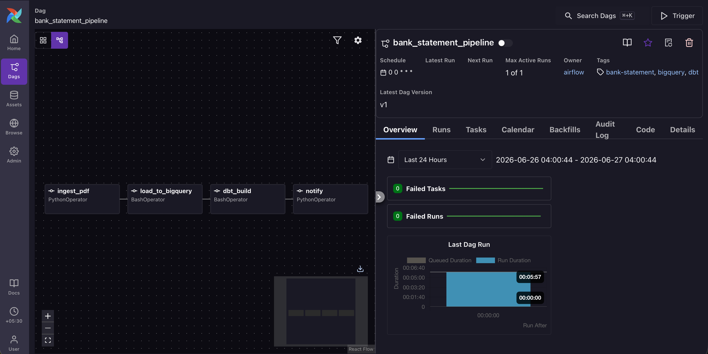

# Airflow / Cloud Composer — batch analytics pipeline

This folder holds the Airflow DAG that orchestrates the **batch / warehouse**
side of the project. It is intentionally separate from the n8n workflow:

| Path | Owner | Trigger | Output |
|------|-------|---------|--------|
| **A — real-time report** | n8n + Flask (`server.py`) | new PDF in Google Drive | Excel report → Drive / Telegram / Email |
| **B — warehouse analytics** | **this Airflow DAG** | schedule (or manual) | `raw` → dbt models in the `analytics` dataset |

Both paths call the same parser core (`Bank_Statement_Analyser`) and the same
category seed (`dbt_bank/seeds/category_keywords.csv`), so categories stay
consistent across the Excel report and BigQuery.

## DAG: `bank_statement_pipeline`




```
ingest_pdf  ->  load_to_bigquery  ->  dbt_build  ->  notify
```

1. **ingest_pdf** — resolves the statement PDF to a local path. Uses
   `dag_run.conf["pdf_path"]` if given (local path or `gs://…`), otherwise
   discovers the newest PDF under the configured GCS prefix.
2. **load_to_bigquery** — runs `load_to_bigquery.py` to append parsed rows into
   `raw.bank_transactions` (append-only load job).
3. **dbt_build** — runs `dbt build` (seeds + models + tests). `fct_transactions`
   is incremental, so only the newly loaded transactions are appended.
4. **notify** — placeholder for downstream signalling (Slack / email / n8n
   webhook). No-op by default.

## Configuration

Set these as **Airflow Variables** (preferred) or environment variables; the DAG
falls back to env vars so it behaves like the CLI:

| Variable | Env var | Notes |
|----------|---------|-------|
| `gcp_project` | `GCP_PROJECT` | BigQuery project |
| `bq_location` | `BQ_LOCATION` | e.g. `asia-south1`; must match the `raw` dataset |
| `repo_dir` | `REPO_DIR` | path to this checkout |
| `dbt_project_dir` | `DBT_PROJECT_DIR` | defaults to `<repo_dir>/dbt_bank` |
| `python_executable` | `PYTHON_EXECUTABLE` | interpreter for the loader (needs `google-cloud-bigquery`, `pdfplumber`, `openpyxl`) |
| `dbt_executable` | `DBT_EXECUTABLE` | dbt binary (the dbt-bigquery venv) |
| `statements_gcs_bucket` | `STATEMENTS_GCS_BUCKET` | where new PDFs land (Composer) |
| `statements_gcs_prefix` | `STATEMENTS_GCS_PREFIX` | default `statements/` |
| `notify_webhook_url` | `NOTIFY_WEBHOOK_URL` | optional; POST target for the `notify` step (n8n / Slack). Unset = no-op |

### Notifications (the `notify` task)

The `notify` task POSTs `{"text": "..."}` to `notify_webhook_url` on success.
That payload is accepted by both targets, so you can use either without code
changes:

- **n8n (you already have this):** add a **Webhook** node in n8n, copy its
  Production URL, and set `notify_webhook_url` to it. The DAG will ping your n8n
  workflow when the warehouse refresh finishes — you can then have n8n forward
  it to Telegram/Email.
- **Slack (optional):** create a free workspace, add an **Incoming Webhook**
  app, copy its URL, and set `notify_webhook_url` to it.

Leave `notify_webhook_url` unset and the task just logs "skipped".

Auth: Application Default Credentials. Locally, `gcloud auth application-default
login`; on Cloud Composer, the environment's service account (grant it BigQuery
Data Editor + Job User, and Storage Object Viewer on the statements bucket).

## Running it

**Local — Astro CLI (recommended for macOS / development)**

The cleanest local Airflow setup. Uses Docker under the hood, so Docker Desktop
must be running. The project skeleton is already checked in at `airflow/astro/`.

```bash
# one-time: install Astro CLI
brew install astro

# start (from the astro folder)
cd airflow/astro
astro dev start
# → UI at http://astro.localhost:6563  (admin / admin)

# stop when done
astro dev stop
```

Trigger a run manually from the UI (▶ Trigger button) or via CLI:
```bash
astro dev run dags trigger bank_statement_pipeline --conf '{"pdf_path":"/path/to/statement.pdf"}'
```

**Cloud Composer**
1. Upload `dags/bank_statement_pipeline.py` to the environment's `dags/` GCS folder.
2. Make the repo + a dbt-bigquery install available to workers (e.g. sync the
   repo to `gcs/data/` and install `dbt-bigquery` via a PyPI package or a custom
   image), then point `repo_dir` / `dbt_executable` at them.
3. Set the Variables above. The `@daily` schedule then discovers and processes
   new PDFs from the GCS prefix.

**Local Airflow (alternative — standalone venv)**
Only if you can't use Docker. Airflow standalone installs into a plain Python venv.
```bash
python3 -m venv ~/airflow-venv && source ~/airflow-venv/bin/activate
pip install "apache-airflow"
export AIRFLOW_HOME=~/airflow-home && mkdir -p ~/airflow-home/dags
cp airflow/dags/bank_statement_pipeline.py ~/airflow-home/dags/
export GCP_PROJECT=n8n-upi-tracker BQ_LOCATION=asia-south1
airflow standalone   # UI at http://localhost:8080
```

### Running on Windows

Airflow does **not** run natively on Windows. Seeing the UI needs WSL2 or Docker
Desktop, both of which require admin rights — and on a corporate/managed machine
they may be blocked by policy or need IT approval (Docker Desktop also has
licensing rules for large orgs). A blocked WSL install typically fails with
`Logon failure ... 0x80070569`, which is a group-policy restriction, not a bug.

**You usually don't need the UI.** The DAG just orchestrates commands you can run
by hand:

| DAG task | Equivalent command |
|----------|--------------------|
| `ingest_pdf` | pick a PDF path |
| `load_to_bigquery` | `python load_to_bigquery.py "statement.pdf"` |
| `dbt_build` | `cd dbt_bank && dbt build` |
| `notify` | POST to your webhook |

If you *do* want the UI and WSL2 is allowed, the lightest route is a venv inside
Ubuntu (no Docker):
```bash
# inside an Ubuntu (WSL2) terminal
python3 -m venv ~/airflow-venv && source ~/airflow-venv/bin/activate
pip install "apache-airflow==2.9.3"
export AIRFLOW_HOME=~/airflow && mkdir -p ~/airflow/dags
cp /mnt/c/GIT_Projects/Bank-Statement-Analyser/airflow/dags/bank_statement_pipeline.py ~/airflow/dags/
airflow standalone      # UI at http://localhost:8080 (prints an admin password)
```

> Note: the loader runs on Python 3.14 and dbt in a 3.12 venv. Point
> `python_executable` / `dbt_executable` at the right interpreters for a real run.
